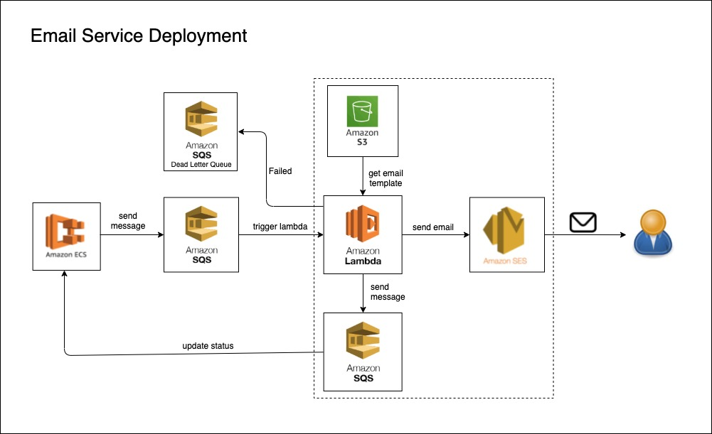
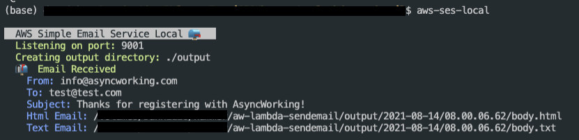
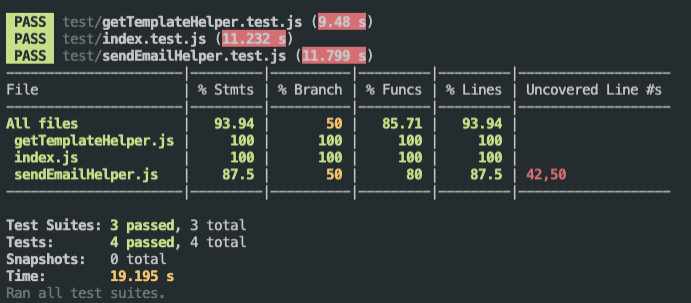

# aw-lambda-sendemail

The architecture is deployed as following:

The following steps demonstrate how to implement and test in local environment.

git clone this project and cd to this folder AW-LAMBDA-SENDEMAIL

`cd AW-LAMBDA-SENDEMAIL`

### step 1: 

Install **localstack** via docker by running docker compose up
Localstack helps you develop your services locally. It mocks commonly used AWS services like S3, DynamoDB, Lambda, SNS, SQS, and more. This way you can develop your service against a mock local version of AWS instead of needing a real AWS account.

`docker compose up`

`npm install`
### step 2:

To do local test integration with aws cloud service, AWS CLI need to be installed locally and we are using awscli-local package, which provides the `awslocal` command for use with LocalStack. The documentation for awscli-local: https://github.com/localstack/awscli-local/blob/master/README.md

`pip install aws`

`pip install awscli-local`

### step 3:

Start the local ses-server package for mocking AWS SES service to listening emails send from lambda.
Documentation refer to https://www.npmjs.com/package/aws-ses-local

switch to a new terminal and run the script:

`aws-ses-local`

Please note:

If not starting this aws-ses-local service, when running the unit test, there will be an error from sendEmailHelper.test.js stating "UnknownEndpoint: Inaccessible host: 'localhost'. This service may not be available in the 'ap-southeast-2' region."

### step 4:
To run the script for creating a lambda function, the AWS services SQS and S3 bucket should already be created in localstack, which can be done by the following script.

`./end_to_end_test/setup-localtest.sh`

### step 5:
To start the function:

`npm start`

To test the function:

`npm test`

in the ./output folder, there will be the email logs sent to the end user with the user name, verification link, destination email address previously code into `payload.json` when invoke the lambda function.

Currently test coverage is 93.94%:

